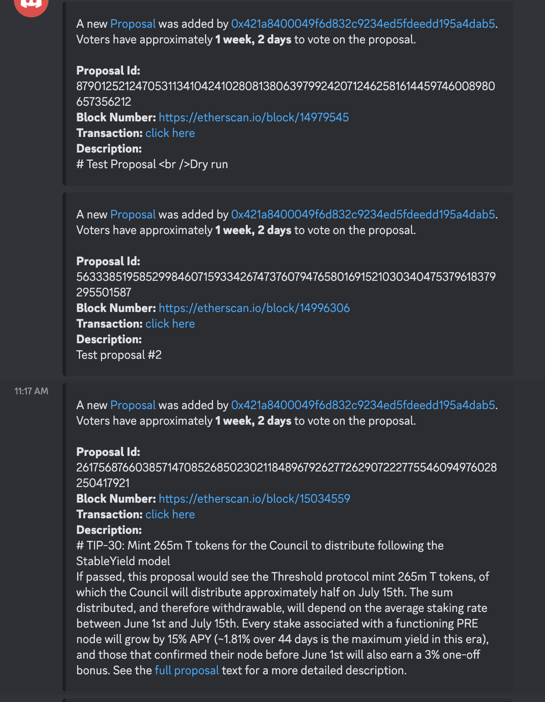

# tBTC DAO Monitoring Bot

### Description
This convenient bot will monitor the tBTC DAO contract for new proposals that are submitted and will send alerts to any channel on a discord server that the bot is allowed to submit into. It contains links to the forum, details about the proposal, the deadline time for the proposal, links to the block, the transaction hash, proposal ID for people wanting on-chain details.

### How to Run the bot
1. This is tested against 3.9.6
2. Create virtual environment in the project directory `python3 -m venv venv`
3. Source the venv `source venv/bin/activate`
4. Install dependencies `pip install -r requirements.txt`
5. Fill the details out in the `.env` file with your discord bot token, the ID of the channel you want the alerts to go to, and your etherscan api token along with the block number from which you want the bot to post the alerts from. If you specify an older block number, the bot will get all the proposal created events from that block and post the details to the channel.
6. When everything is configured, run `python bot.py` and watch the console for logs. The logs wll be written to STD OUT for simplicity and with linux commands, it can be piped to a file and configured as a json logger for log monitoring software to easily parse for events from the bot.

### Example outputs

#### The logs
```
2023-02-26 11:17:47 INFO     discord.client logging in using static token
INFO:discord.client:logging in using static token
2023-02-26 11:17:48 INFO     discord.gateway Shard ID None has connected to Gateway (Session ID: e9690e656bb02662c9c65706cf7f42ce).
INFO:discord.gateway:Shard ID None has connected to Gateway (Session ID: e9690e656bb02662c9c65706cf7f42ce).
INFO:tbtc-dao-monitoring:Testing posting stuff to channel#7879 connected to Discord!
INFO:tbtc-dao-monitoring:got the data from etherscan successfully.
INFO:tbtc-dao-monitoring:start block updated from 14083179 to 14979545
INFO:tbtc-dao-monitoring:start block updated from 14979545 to 14996306
INFO:tbtc-dao-monitoring:start block updated from 14996306 to 15034559
INFO:tbtc-dao-monitoring:start block updated from 15034559 to 15777470
INFO:tbtc-dao-monitoring:got the data from etherscan successfully.
```

#### Example alerts

